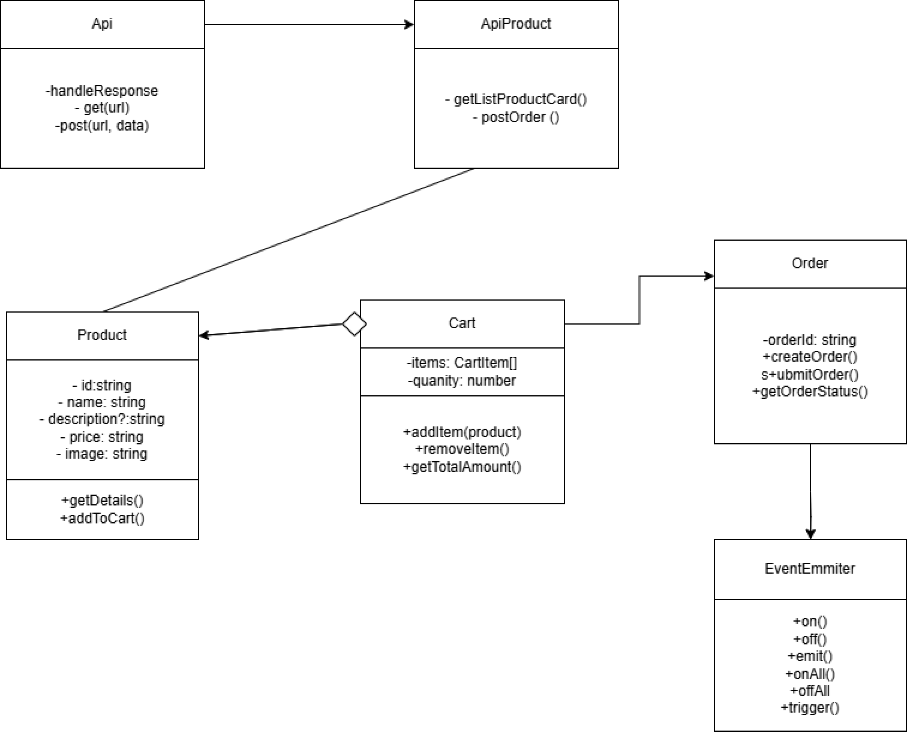

# **Проектная работа "Веб-ларек"**

Интернет-магазин с товарами для веб-разработчиков — Web-ларёк. В нём можно посмотреть каталог товаров, добавить товары в корзину и сделать заказ.

## **Используемый стек:**

* HTML, 
* SCSS, 
* TS, 
* Webpack

## **Структура проекта:**
* src/ — исходные файлы проекта
* src/components/ — папка с JS компонентами
* src/components/base/ — папка с базовым кодом

### **Важные файлы:**
* src/pages/index.html — HTML-файл главной страницы
* src/types/index.ts — файл с типами
* src/index.ts — точка входа приложения
* src/scss/styles.scss — корневой файл стилей
* src/utils/constants.ts — файл с константами
* src/utils/utils.ts — файл с утилитами

## **Установка и запуск**
Клонировать репозиторий

```
git clone https://github.com/Mozarh/web-larek-frontend.git
```

После клонирования проекта установить зависимости:

```
npm install 
```

Для запуска проекта в режиме разработки выполнить команду:

```
​npm run start 
```

Для сборки проекта в продакшен выполнить команду: 

```
​npm run build
```

## **Архитектура**



## **Базовый код**

1. Класс Api

*Методы:*
* handleResponse(response: Response): Promise<object>: обработчик ответа сервера.
* get(uri: string) - принимает изменяющеюся часть url-адреса, возвращает ответ от сервера.
* post(uri: string, data: object, method: ApiPostMethods = 'POST') - принимает изменяющеюся часть url-адреса, принимает данные в виде объекта для отправки на сервер

2. Класс EventEmitter- обеспечивает работу событий. Его функции: возможность установить и снять слушателей событий, вызвать слушателей при возникновении события.

*Методы:*
* on - Установить обработчик на событие.
* off - Снять обработчик с события.
* emit - Инициировать событие с данными.
* onAll - Слушать все события.
* offAll - Сбросить все обработчики.
* trigger - Сделать коллбек триггер, генерирующий событие при вызове.

3. ApiProduct - наследуется от класса Api, передаёт и получает данные от сервера.

*Методы:*
* getListProductCard - получаем массив объектов(карточек) с сервера.
* postOrder- получаем ответ от сервера по сделанному/отправленному заказу.

4. Класс Product - описывает товар с полями id, name, description, price, imageUrl. Этот класс может быть использован для хранения информации о товаре и работы с API для получения данных о товаре.

*Назначение:* Описание продукта и взаимодействие с ним.

*Методы:*
* getDetails(): Возвращает подробную информацию о товаре
* addToCart(): Добавляет товар в корзину.

5. Класс Cart - управляет корзиной покупок, где можно добавлять и удалять товары, а также вычислять общую стоимость корзины. Корзина будет хранить список товаров и их количество.

*Назначение:* Управление корзиной покупок, добавление/удаление товаров

*Методы:*
* addItem(product:Product): добавляет товар в корзину.
* removeItem(): Убирает товар из корзины.
* getTotalAmount(): Рассчитывает и возвращает общую стоимость товаров в корзине.

6. Класс Order - управляет заказом и отправкой данных на сервер. Он включает информацию о заказе, покупателе и списке товаров в корзине.

*Назначение:* Оформление заказа и взаимодействие с API для отправки данных о заказе.

*Методы:*
* createOrder(cart: Cart, customerInfo: CustomerInfo): Создаёт новый заказ.
* submitOrder(order: Order): Отправляет заказ на сервер.
* getOrderStatus(orderId: string): Получает статус заказа.

## **Взаимодействие классов**

1. Добавление товара в корзину.
* Товар добавляется в корзину с помощью метода addItem класса Cart.
* В корзину можно добавить несколько одинаковых товаров, которые будут отслеживаться по количеству.
2. Оформление заказа.
* При оформлении заказа создаётся объект Order, который содержит данные о покупателе и товарах из корзины.
3. Взаимодействие с сервером.
* Для взаимодействия с сервером используется стандартный fetch API для получения данных о товарах, добавления товаров в корзину, удаления товаров и оформления заказов.
